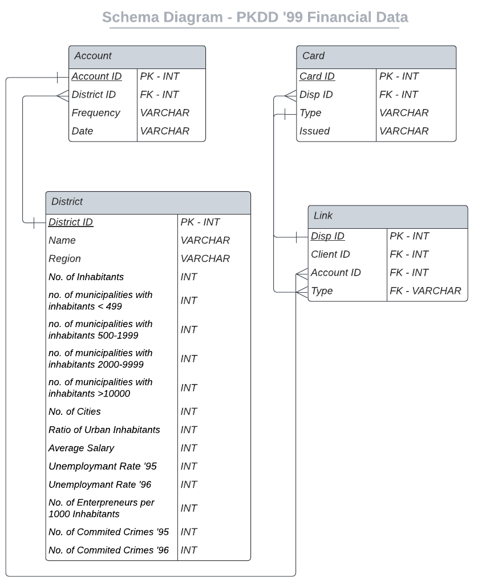

---
jupytext:
  text_representation:
    extension: .md
    format_name: myst
    format_version: 0.13
    jupytext_version: 1.14.6
kernelspec:
  display_name: Python 3 (ipykernel)
  language: python
  name: python3
---

# Combining Data from Multiple Tables

In the last section, we learned about joining two tables in SQL. We now build upon those basics to learn to combine multiple tables into a tidy, single table.  

Let's first run the installations and setup before running any queries, just like the last lesson `joining-data-in-sql`.

<!-- region -->

## Install - execute this once. 

```{important}
<b>Note:</b> If you are following these lessons locally and <b>not</b> on Google Colab, then there is no need to reinstall these packages.
```

This code installs JupySQL, DuckDB, and Pandas in your environment. We will be using these moving forward.

```{code-cell} ipython3
%pip install jupysql --upgrade duckdb-engine pandas --quiet
```

## Load the data

```{important}
<b>Note:</b> If you are following these lessons locally and <b>not</b> on Google Colab, then there is no need to load the data again. 
```

We extract the financial data by retrieving it from its URL download link [here](http://sorry.vse.cz/~berka/challenge/pkdd1999/data_berka.zip). The link is a zip file, so we extract the zip file and convert the compressed `.asc` files to `.csv` files. Finally, we save the converted data into a folder named `expanded_data`.

Dataset citation:

“PKDD’99 Discovery Challenge Guide to the Financial Data Set.” Home page of PKDD Discovery Challenge, 1999. https://sorry.vse.cz/~berka/challenge/PAST/.

```{code-cell} ipython3
import csv
import urllib.request
import zipfile
import os

def extract_asc_to_csv(url, output_folder):
    # Download the ZIP file
    zip_file_path, _ = urllib.request.urlretrieve(url)

    # Extract the ZIP file
    with zipfile.ZipFile(zip_file_path, 'r') as zip_ref:
        zip_ref.extractall(output_folder)

    # Process ASC files and convert them to CSV
    for file_name in zip_ref.namelist():
        if file_name.endswith('.asc'):
            asc_file_path = os.path.join(output_folder, file_name)
            csv_file_path = os.path.join(output_folder, file_name[:-4] + '.csv')

            with open(asc_file_path, 'r') as asc_file, open(csv_file_path, 'w', newline='') as csv_file:
                asc_reader = csv.reader(asc_file, delimiter=';')  # Specify the delimiter used in the .asc file
                csv_writer = csv.writer(csv_file, delimiter=',')

                for row in asc_reader:
                    csv_writer.writerow(row)

            print(f'Converted {asc_file_path} to CSV.')

    print('All ASC files converted to CSV.')

# Example usage
extract_asc_to_csv('http://sorry.vse.cz/~berka/challenge/pkdd1999/data_berka.zip', 'expanded_data')
```

After running this code, you should have the folder `expanded_data` in the current directory. Within this folder, shall be present the eight converted `.csv` files for our analysis. However, we shall focus on a subset of these eight files.

## Load Engine

We now load in our SQL extension that allows us to execute SQL queries in Jupyter Notebooks. 

```{tip}
<b>Note</b> Ensure you restart any previous notebook that has the same database name as the one initialized below.
```

```{code-cell} ipython3
# Loading in SQL extension
%reload_ext sql
# Initiating a DuckDB database named 'bank.duck.db' to run our SQL queries on
%sql duckdb:///bank_data.duck.db
```

## Schema Diagram

A schema diagram is useful to help understand the relationship between two or more tables in a schema. Each table in the diagram represents a dataset. The variables of each dataset are represented as rows. The first column is the variable name while the second column is the variable's value type alongside if the variable is a primary key (PK) or foreign key (FK). 

In this section, we shall be focusing on joining the following 4 tables: `account`, `card`, `district`, and `disp`. The schema diagram for these tables is shown below.



## Creating Tables

Let's start off with loading four of the eight `.csv` files from the `expanded_data` folder in the current directory to our newly created DuckDB database. Like in the previous tutorial, we shall create a schema `s1` in which we will store the tables. Here we use the `CREATE TABLE` syntax in DuckDB to ingest four of the eight `.csv` files. The `read_csv_auto` is a function that helps SQL understand our local `.csv` file for creation into our database.

```{code-cell} ipython3
%%sql
CREATE SCHEMA s1;
CREATE TABLE s1.account AS
FROM read_csv_auto('expanded_data/account.csv', header=True, sep=',');
CREATE TABLE s1.district AS
FROM read_csv_auto('expanded_data/district.csv', header=True, sep=',');
CREATE TABLE s1.card AS
FROM read_csv_auto('expanded_data/card.csv', header=True, sep=',');
CREATE TABLE s1.link AS
FROM read_csv_auto('expanded_data/disp.csv', header=True, sep=',');
```

## Renaming Columns

Before we start joining the above ingested tables, we need to rename the columns of the `district` table for better readability. We can do this by using the `ALTER TABLE` syntax in DuckDB. The `RENAME COLUMN` syntax allows us to rename a column in a table. 

```{important}
We can also rename multiple columns in a table by separating the column names with a comma. However, this method is not supported by DuckDB. Be sure to look at the documentation of the database you are using to see if it supports this feature.
```

```{code-cell} ipython3
%%sql
ALTER TABLE s1.district
RENAME COLUMN A1 TO district_id;
ALTER TABLE s1.district
RENAME COLUMN A2 TO district_name;
ALTER TABLE s1.district
RENAME COLUMN A3 TO region;
ALTER TABLE s1.district
RENAME COLUMN A4 TO no_of_inhabitants;
ALTER TABLE s1.district
RENAME COLUMN A5 TO no_of_municipalities_lt_499;
ALTER TABLE s1.district
RENAME COLUMN A6 TO no_of_municipalities_500_1999;
ALTER TABLE s1.district
RENAME COLUMN A7 TO no_of_municipalities_2000_9999;
ALTER TABLE s1.district
RENAME COLUMN A8 TO no_of_municipalities_gt_10000;
ALTER TABLE s1.district
RENAME COLUMN A9 TO no_of_cities;
ALTER TABLE s1.district
RENAME COLUMN A10 TO ratio_of_urban_inhabitants;
ALTER TABLE s1.district
RENAME COLUMN A11 TO average_salary;
ALTER TABLE s1.district
RENAME COLUMN A12 TO unemployment_rate_95;
ALTER TABLE s1.district
RENAME COLUMN A13 TO unemployment_rate_96;
ALTER TABLE s1.district
RENAME COLUMN A14 TO no_of_entrepreneurs_per_1000_inhabitants;
ALTER TABLE s1.district
RENAME COLUMN A15 TO no_of_committed_crimes_95;
ALTER TABLE s1.district
RENAME COLUMN A16 TO no_of_committed_crimes_96;
```

## Combining All Tables

Insert tutorial

<!-- #endregion -->

## You try: Use JupySQL to perform the queries and answer the questions.

### Question 1 (Easy):
Write a SQL query, with *equi JOINs*, to join the `account`, `card`, `district`, and `link` tables from the `s1` schema in the DuckDB database. Include relevant columns from each table in the result set.

<!-- #region -->
<details>

<summary>Answers</summary>

Recall that in the previous section, we learned that the `account` table contains a column named `district_id`, which serves as a foreign key referencing the primary key in the `district` table. Similarly, the `card` table has a column named `disp_id`, which is a foreign key referencing the primary key in the `link` table. By utilizing these relationships, we can perform a join operation on these tables to obtain a consolidated result set.

To combine the `account`, `card`, `district`, and `link` tables, we can use the following SQL query:

```{code-cell} ipython3
%%sql 
SELECT a.account_id, c.card_id, d.district_id, l.disp_id
FROM s1.account AS a
INNER JOIN s1.district AS d ON a.district_id = d.district_id
INNER JOIN s1.link AS l ON l.account_id = a.account_id
INNER JOIN s1.card AS c ON c.disp_id = l.disp_id; 
```

In this query, we are performing a series of `INNER JOIN` operations to merge the tables based on the specified join conditions. The `ON` clause defines the relationship between the columns that are used for joining.

By including the `*` in the `SELECT` statement, we are retrieving all columns from each of the joined tables in the result set. However, it is recommended to specify the specific columns you need to avoid unnecessary data retrieval.

Executing this query will return a single table that combines the relevant columns from the `account`, `card`, `district`, and `link` tables.

```tip
The above query can also be written without the `INNER JOIN` clause! Another way to write the query is as follows:

~~~python
SELECT a.account_id, c.card_id, d.district_id, l.disp_id
FROM s1.account as a, s1.card as c, s1.district as d, s1.link as l
WHERE a.district_id = d.district_id AND
      l.account_id = a.account_id AND
      c.disp_id = l.disp_id;
~~~
```

</details>
<!-- #endregion -->

### Question 2 (Medium):
If tables `links` and `cards` did not have matching rows that are related to each other, what kind of join would you use to combine these tables? If you were to use this join, and then join the resulting table with the merged table of `account` and `district`, how would the final output differ from Question 1?

<!-- #region -->
<details>

<summary>Answers</summary>

A `FULL OUTER JOIN` would be used to combine the `links` and `cards` tables if we want to keep both the rows that can be matched and the unpaired rows. This is because, in this case, the tables `links` and `cards` do not have matching rows that are related to each other. Therefore, we need to account for the unpaired rows in the result set. 

The `FULL OUTER JOIN` will return all rows from both tables, and if there are no matches, the columns from the other table will be filled with `NULL` values. This is in contrast to the `INNER JOIN`, which only returns rows that have matching values in both tables and, hence, no `NULL` values.

Code to implement the `FULL OUTER JOIN` is shown below:

```{code-cell} ipython3
%%sql
SELECT a.account_id, c.card_id, d.district_id, l.disp_id
FROM s1.link AS l
FULL OUTER JOIN s1.card AS c ON l.disp_id = c.disp_id 
INNER JOIN s1.account AS a ON a.account_id = l.account_id 
INNER JOIN s1.district AS d ON d.district_id = a.district_id;
```

Therefore, the final output will include all rows from the `links` and `cards` tables, as well as the rows from the `account` and `district` tables that have matching values in the `links` and `cards` tables. Because the `links` table has the highest number of rows, 5369, all of them will be included in the final output. The rows from the `account` and `district` tables that do not have matching values in the `links` and `cards` tables will not be included in the final output. Since a `FULL OUTER JOIN` is used first, the final output will include all rows from the `links` and `cards` tables, even if there are no matching values in the `account` and `district` tables.

</details>
<!-- #endregion -->

### Question 3 (Medium):
Create a junction table, `account_district`.

<b>Hint</b> `COUNT()` is a aggregating function in SQL (more on aggregation later!). Try experimenting with `COUNT()` in your `SELECT` clause to see if you can find the correct count.

<!-- #region -->
<details>
<summary>Answers</summary>


```{code-cell} ipython3
%%sql
SELECT 
FROM 
WHERE 
```

</details>
<!-- #endregion -->

<!-- #region -->

## Wrapping Up

In this section, we learnt about how to join more than two tables. To summarize:

- `INNER JOIN` and `JOIN` : The `JOIN` function is a shorthand for `INNER JOIN`. It can be used interchangeably with `INNER JOIN` to achieve the same result. Both functions combine rows from multiple tables, based on specified join conditions. They return only the rows that have matching values in both tables being joined. The join conditions are specified using the `ON` keyword, where you define the columns from each table that should be compared for the join.

- `FULL OUTER JOIN` :  The `OUTER JOIN` function combines rows from multiple tables, based on specified join conditions. It returns all rows from both tables, and if there are no matches, the columns from the other table will be filled with `NULL` values.

This brings us to a wrap of the first module: `Intro to SQL`! We hope you have enjoyed the content and are ready to move on to the next module: `Interactive Queries and Parameterization`.

<!-- #endregion -->
