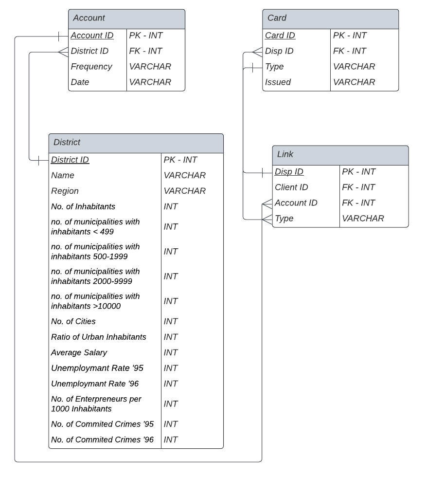

---
jupytext:
  text_representation:
    extension: .md
    format_name: myst
    format_version: 0.13
    jupytext_version: 1.14.6
kernelspec:
  display_name: Python 3 (ipykernel)
  language: python
  name: python3
---

# Combining Data from Multiple Tables

In the last section, we learned about joining two tables in SQL. We now build upon those basics to learn to combine multiple tables into a tidy, single table.  

Let's first run the installations and setup before running any queries, just like the previous lesson: [Joining Data in SQL](https://ploomber-sql.readthedocs.io/en/latest/intro-to-sql/joining-data-in-sql.html#install-execute-this-once).

<!-- region -->

## Install - execute this once.

```{important}
<b>Note:</b> If you are following these lessons locally and <b>not</b> on Google Colab, then there is no need to reinstall these packages.
```

This code installs JupySQL, DuckDB, and Pandas in your environment. We will be using these moving forward.

```{code-cell} ipython3
%pip install jupysql duckdb-engine pandas --quiet
```

## Load the data

```{important}
<b>Note:</b> If you are following these lessons locally and <b>not</b> on Google Colab, then there is no need to load the data again. 
```

This section was covered in detail in the previous tutorial: [Joining Data in SQL](https://ploomber-sql.readthedocs.io/en/latest/intro-to-sql/joining-data-in-sql.html#load-the-data). We will be using the same data in this tutorial as well.

```{code-cell} ipython3
import sys

sys.path.insert(0, "../../")
import banking  # noqa: E402


_ = banking.MarketData("https://tinyurl.com/jb-bank-m", "expanded_data")
_.extract_asc_to_csv()
```

If you ran the above cell, you should have a folder `expanded_data` in your current directory that contains the `.csv` files we will be using. However, in this tutorial, we will focus on four out of the eight `.csv` files.

## ER Diagram

In the previous tutorial, we provided an [Entity-Relationship Diagram (ERD)](https://ploomber-sql.readthedocs.io/en/latest/intro-to-sql/joining-data-in-sql.html#datasets) to help us understand the relationship between the `account` and `district` tables. In this section, we will augment that diagram to understand the relationship between multiple tables.

Each table in the diagram represents a dataset. The variables of each dataset are represented as rows. The first column is the variable name while the second column is the variable's value type alongside if the variable is a primary key (PK) or foreign key (FK).

```{important}
If you are unfamiliar with the terms primary key and foreign key, please refer to the [previous tutorial](https://ploomber-sql.readthedocs.io/en/latest/intro-to-sql/joining-data-in-sql.html#what-is-a-primary-key-and-a-foreign-key) for more information.
```

In this section, we will be focusing on joining the following 4 tables: `account`, `card`, `district`, and `disp`. The schema diagram for these tables is shown below.



The account `table` has a foreign key column named "district_id" referencing the primary key in the `district` table. The `card` table has a foreign key column named "disp_id" referencing the primary key in the `disp table`, and the `link` table has a foreign key column named "account_id" referencing the primary key in the `account` table. It's worth noting that the "type" columns in the `card` and `disp` tables are not foreign keys; they represent categorical variables indicating the type of card and disposition, respectively.

The notations of the line connecting our two tables indicate their relationship type and is defined as "Crow's Foot Notation". To learn more about this notation, we recommend visiting this article: https://vertabelo.com/blog/crow-s-foot-notation/

<!-- endregion -->

## Load Engine

We now load in our SQL extension that allows us to execute SQL queries in Jupyter Notebooks.

```{important}
<b>Note</b> Ensure you restart any previous notebook that has the same database name as the one initialized below.
```

```{code-cell} ipython3
# Loading in SQL extension
%reload_ext sql
# Initiating a DuckDB database named 'bank_data.duck.db' to run SQL queries
%sql duckdb:///bank_data.duck.db
```

## Creating Tables

Let's start off with loading four of the eight `.csv` files from the `expanded_data` folder in the current directory to our newly created DuckDB database. Like in the previous tutorial, we will [create a schema](https://ploomber-sql.readthedocs.io/en/latest/intro-to-sql/joining-data-in-sql.html#creating-a-schema) `s1` in which we will store the tables. Here we use the `CREATE TABLE` syntax in DuckDB to ingest four of the eight `.csv` files. The `read_csv_auto` is a function that helps SQL understand our local `.csv` file for creation into our database.

```{code-cell} ipython3
%%sql
CREATE SCHEMA s1;
CREATE TABLE s1.account AS
FROM read_csv_auto('expanded_data/account.csv', header=True, sep=',');
CREATE TABLE s1.district AS
FROM read_csv_auto('expanded_data/district.csv', header=True, sep=',');
CREATE TABLE s1.card AS
FROM read_csv_auto('expanded_data/card.csv', header=True, sep=',');
CREATE TABLE s1.link AS
FROM read_csv_auto('expanded_data/disp.csv', header=True, sep=',');
```

## Combining Multiple Tables

When combining more than two tables, it is imperative to know what the final result of our joins will look like. If we are familiar with the desired output before executing our queries, we can make an informed decision on whether to use an `INNER JOIN`, `OUTER JOIN`, or `FULL JOIN` to achieve our desired result. In short, assessing the case at hand will help us determine the type of join to use.

To quickly refresh our memory from the previous tutorial on [`INNER JOIN`](https://ploomber-sql.readthedocs.io/en/latest/intro-to-sql/joining-data-in-sql.html#inner-join), recall that an `INNER JOIN` is suitable when we want to retrieve only the matching records, effectively filtering out any unmatched records, between the tables involved in the join. Therefore, the result will contain only the rows where the join condition is met in all the joined tables.

On the other hand, an `OUTER JOIN` can be of three types: <b>Left, Right, and Full</b>. They were covered extensively in the [previous tutorial](https://ploomber-sql.readthedocs.io/en/latest/intro-to-sql/joining-data-in-sql.html#left-join), but here is a quick refresher. In situations where we need to retrieve all records from one table, regardless of whether there is a match in the other tables, an `OUTER JOIN` can be used. This is particularly useful when we want to <b>include supplementary information or handle missing data</b>. A `LEFT JOIN` includes all rows from the left table (the table specified before the LEFT JOIN keyword) and the matching rows from the right table(s) (the table(s) specified after the `LEFT JOIN` keyword). Similarly, a `RIGHT JOIN` includes all rows from the right table(s) and the matching rows from the left table. A `FULL JOIN` combines operations of both the `LEFT JOIN` and `RIGHT JOIN`, including all rows from both tables and matching rows where the join condition is met.

Therefore, understanding the desired output and the relationships between the tables will help us determine whether an `INNER JOIN` or an `OUTER JOIN` is more appropriate for obtaining the desired result. By utilizing the appropriate join type and leveraging primary and foreign keys, we can combine data from multiple tables efficiently.

### INNER JOIN

Suppose that we want to retrieve common data points between the `account`, `card`, `district`, and `link` tables because unmatched records represent churned customers who do not utilize this bank's services anymore. Therefore, we can use the `INNER JOIN` to join the `account`, `card`, `district`, and `link` tables on their respective foreign keys. The query below demonstrates how we can use the `INNER JOIN` to join the four tables:

```{code-cell} ipython3
%%sql 
SELECT a.account_id, c.card_id, d.district_id, l.disp_id
FROM s1.account AS a
INNER JOIN s1.district AS d 
ON a.district_id = d.district_id
INNER JOIN s1.link AS l 
ON l.account_id = a.account_id
INNER JOIN s1.card AS c 
ON c.disp_id = l.disp_id; 
```

The result of the query above is a table containing the primary key columns from each table. The number of rows is 892, which signifies that there are 892 matching records between the four tables. This means that there are 892 customers who have accounts, cards, and are linked to a district. Next, attempt the question below to drive home your understanding of the `INNER JOIN`!

#### Question 1 (Medium):
Suppose we want to analyze the spending patterns of customers across different districts based on their account and card information. Unmatched records could represent customers who have recently opened accounts or received new cards and are yet to make any transactions. Write a SQL query to join the `account`, `card`, `district`, and `link` tables from the `s1` schema in the DuckDB database. Include only primary key columns from each table in the result set.

<!-- #region -->
<details>

<summary>Answers</summary>

We should use an `INNER JOIN` to exclude unmatched data points, so that we can focus our analysis on customers who have actively used their accounts and cards for transactions.

Recall that in the [previous tutorial](https://ploomber-sql.readthedocs.io/en/latest/intro-to-sql/joining-data-in-sql.html#what-is-a-primary-key-and-a-foreign-key), we learned that the `account` table contains a column named `district_id`, which serves as a foreign key referencing the primary key in the `district` table. Similarly, the `card` table has a column named `disp_id`, which is a foreign key referencing the primary key in the `link` table. By utilizing these relationships, we can perform a join operation on these tables to obtain a consolidated result set.

To combine the `account`, `card`, `district`, and `link` tables, we can use the following SQL query:

```{code-cell} ipython3
%%sql 
SELECT a.account_id, c.card_id, d.district_id, l.disp_id
FROM s1.account AS a
INNER JOIN s1.district AS d 
ON a.district_id = d.district_id
INNER JOIN s1.link AS l 
ON l.account_id = a.account_id
INNER JOIN s1.card AS c 
ON c.disp_id = l.disp_id; 
```

In this query, we are performing a series of `INNER JOIN` operations to merge the tables based on the specified join conditions. The `ON` clause defines the relationship between the columns that are used for joining. The `SELECT` statement retrieves only the primary keys from each of the joined tables in the result set.

```{important}
The above query can also be written without the `INNER JOIN` clause! Another way to write the query is as follows:
```

```python
%%sql
SELECT a.account_id, c.card_id, d.district_id, l.disp_id
FROM s1.account as a, s1.card as c, s1.district as d, s1.link as l
WHERE a.district_id = d.district_id AND
      l.account_id = a.account_id AND
      c.disp_id = l.disp_id;
```

</details>
<!-- #endregion -->

### OUTER JOIN

Suppose that the bank is planning to hike interest rates on accounts because the districts, where they have their branches, have gentrified over the past couple of years. We want to analyze not only the activity of customers across different districts based on their account and card information, but also district-level statistics (employment rate and crime rate). However, we also want to include customers who have recently opened accounts or received new cards and are yet to make any transactions. Therefore, we should use an `OUTER JOIN`, preferably the `LEFT JOIN`, so that we can capture records of all customers and appropriately conduct a district-wide analysis.

The query below demonstrates how we can use the `LEFT JOIN` to join the tables `account`, `card`, `district`, and `link`:

```{code-cell} ipython3
%%sql 
SELECT DISTINCT a.account_id, c.card_id, d.district_id, l.disp_id, d.unemployment_rate_95, d.unemployment_rate_96, d.no_of_committed_crimes_95, d.no_of_committed_crimes_96
FROM s1.district AS d
LEFT JOIN s1.account AS a
ON a.district_id = d.district_id
LEFT JOIN s1.link AS l 
ON l.account_id = a.account_id
LEFT JOIN s1.card AS c 
ON c.disp_id = l.disp_id;
```

In contrast to the `INNER JOIN`, the order of the tables plays an important role in the `LEFT JOIN`, and the results may be completely different if the order changes in your SQL query. When determining the order of tables in a `LEFT JOIN`, the <b>general rule is to start with the table from which you want to keep all the records in the final result</b>. Therefore, in the above example, instead of starting with the `account` table, we started with the `district` table, because we want to keep all the records from the `district` table in the final result.

Also, keep in mind that a `LEFT JOIN` cascades to all joins in a query. If you use a `LEFT JOIN`, often the subsequent tables should also be left-joined. An `INNER JOIN` will drop records not found on both sides of the join, and you might lose all the records you want to keep.

Furthermore, a `LEFT JOIN` should be used for the third table when the first table has records not found in the second (and so on) and a different common field is used to join the second and the third tables. An `INNER JOIN` in this situation will drop all the records from the first table not matched to the second and third tables.

#### Question 2 (Hard):

Suppose <b>only</b> tables `links` and `cards` did not have matching rows that are related to each other, what kind of join would you use to combine these tables? If you were to use this join, and then join the resulting table with the merged table of `account` and `district`, how would the final output differ from Question 1?

<b>Hint:</b> We can use both `INNER JOIN` and `OUTER JOIN` in a single query! The first step would be to think about the type of `JOIN` to combine the `links` and `cards` tables. Then, how can this table be joined with the remaining tables if the remaining tables have matching rows that are related to each other?

<!-- #region -->
<details>

<summary>Answers</summary>

A `FULL OUTER JOIN` would be used to combine the `links` and `cards` tables if we want to keep both the rows that can be matched and the unpaired rows. This is because, in this case, the tables `links` and `cards` do not have matching rows that are related to each other. Therefore, we need to account for the unpaired rows in the result set. 

The `FULL OUTER JOIN` will return all rows from both tables, and if there are no matches, the columns from the other table will be filled with `NULL` values. This is in contrast to the `INNER JOIN`, which only returns rows that have matching values in both tables and, hence, no `NULL` values.

Code to implement the multiple joins is shown below:

```{code-cell} ipython3
%%sql
SELECT a.account_id, c.card_id, d.district_id, l.disp_id
FROM s1.link AS l
FULL OUTER JOIN s1.card AS c 
ON l.disp_id = c.disp_id 
INNER JOIN s1.account AS a 
ON a.account_id = l.account_id 
INNER JOIN s1.district AS d 
ON d.district_id = a.district_id;
```

Therefore, the final output will include all rows from the `links` and `cards` tables, as well as the rows from the `account` and `district` tables that have matching values in the `links` and `cards` tables. Because the `links` table has the highest number of rows, 5369, all of them will be included in the final output. The rows from the `account` and `district` tables that do not have matching values in the `links` and `cards` tables will not be included in the final output. Since a `FULL OUTER JOIN` is used first, the final output will include all rows from the `links` and `cards` tables, even if there are no matching values in the `account` and `district` tables.

</details>
<!-- #endregion -->

## Wrapping Up

In this section, we learnt about how to join more than two tables. To summarize:

- When combining multiple tables, it is important to understand the desired output and the relationships between the tables to determine the appropriate join type.

- Understanding primary and foreign keys helps in performing join operations efficiently.

- `INNER JOIN` and `JOIN` : The `JOIN` function is a shorthand for `INNER JOIN` and is used interchangeably with `INNER JOIN` to achieve the same result. Both functions combine rows from multiple tables, based on specified join conditions. <b>They return only the rows that have matching values in both tables being joined</b>. The join conditions are specified using the `ON` keyword, where you define the columns from each table that should be compared for the join.

- An `OUTER JOIN`, such as the `LEFT JOIN`, can be used to retrieve all records from one table regardless of whether there is a match in the other tables. This is useful when including supplementary information or handling missing data.

- The order of tables in a LEFT JOIN is important, and it cascades to all joins in a query. Start with the table from which you want to keep all the records in the final result.

This brings us to a wrap of the first module: `Intro to SQL`! We hope you have enjoyed the content and are ready to move on to the next module: `Interactive Queries and Parameterization`.

<!-- #endregion -->

## References

Dataset citation:

“PKDD’99 Discovery Challenge Guide to the Financial Data Set.” Home page of PKDD Discovery Challenge, 1999. https://sorry.vse.cz/~berka/challenge/PAST/.
