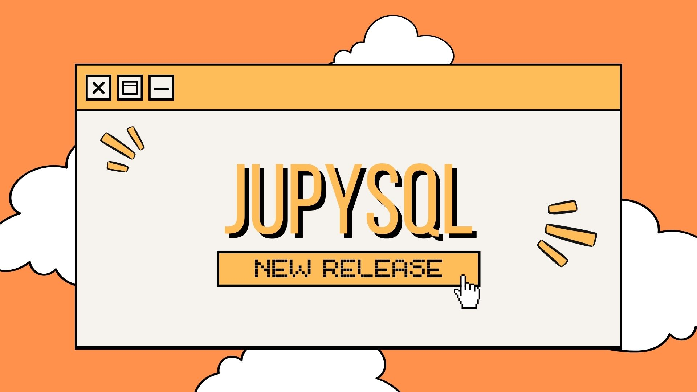

---
jupytext:
  text_representation:
    extension: .md
    format_name: myst
    format_version: 0.13
    jupytext_version: 1.14.6
kernelspec:
  display_name: jupyblog
  language: python
  name: python3
---

# Data wrangling and exploratory data analysis in Jupyter

In the previous tutorial, we used a Python script to call a movie database API and populate a DuckDB instance with the extracted movie data. Furthermore, we packaged the script within a Ploomber pipeline. In this tutorial, we will expand our pipeline to incorporate exploratory data analysis and data wrangling with SQL using a Jupyter notebook. This step will involve extracting data, data wrangling, and creating new tables.

```{important}
This tutorial assumes you have completed the previous tutorial and have a DuckDB instance populated with movie data.
```

Ensure you have completed all steps up to this point and execute

```bash
cd mini-projects/movie-rec-system
poetry run ploomber build
```


## Setup

Within our folder structure, we will create a Jupyter notebook called `eda.ipynb` in the `etl` folder. From last time, our folder structure should look like this:

```bash
mini-projects
├──movie-rec-system
├──├── movies_data.duckdb
├──├── movies_data.duckdb.wal
├──├── pipeline.yaml
├──├── pyproject.toml
├──├── README.md
├──├── etl
├──│   └── extract.py
├──│   └── eda.ipynb
├──├── products
├──     └── extract-pipeline.ipynb
├──└── tests
├──│       └── __init__.py
├──└── .env
```

```{important}
If running the notebook in VSCode, you will need to install the [Jupyter extension](https://marketplace.visualstudio.com/items?itemName=ms-toolsai.jupyter) to run the notebook.
```

To load the data from our DuckDB instance within Jupyter, we will use [JupySQL](https://github.com/ploomber/jupysql). JupySQL allows you to run SQL and plot large datasets in Jupyter via a %sql, %%sql, and %sqlplot magics. 

## Loading `%sql` extension and `DuckDB` instance

To set up access to the database, we will use the `%sql` extension from `jupysql`. 

```{code-cell} ipython3
%reload_ext sql
```

```{important}
Did you know you can configure the default behavior of the `%sql` magic? The configuration above will transform SQL query results into `pandas` format automatically. Learn more in the video below ⬇️⬇️⬇️ [](https://www.youtube.com/watch?v=dJl-MMNoMXk).
```

We can then form a connection string to our DuckDB instance. We will use the `%%sql` magic to run SQL queries in our notebook. Notice that when creating and executing this notebook, we are using the same environment as our pipeline. This ensures that we are using the same dependencies and versions as our pipeline.

We need to give our notebook access to the DuckDB instance. To do this, we will use the `duckdb:///` prefix. This prefix tells JupySQL to use the DuckDB engine to connect to the database. We will then specify the path to our DuckDB instance.

```{code-cell} ipython3
%sql duckdb:///movies_data.duckdb
```

## ⚡⚡ Challenge ⚡⚡

Explore the tables in the `movies_data.duckdb` instance. Use the `%sql` magic to run SQL queries to explore the tables. How many tables are there? What are the columns in each table? What are the data types of each column? What are the primary keys? What are the foreign keys? What are the relationships between the tables?

## Data Wrangling 

### Handling Nested Data

Let's take a look at the data. We will start by looking at the `movies` table. We can use the `%%sql` magic to run SQL queries in our notebook. We will use the `SELECT` statement to select all columns from the `movies` table. We will then use the `LIMIT` statement to limit the number of rows returned to 5.

```{code-cell} ipython3
%%sql 
SELECT *
FROM movies
LIMIT 2;
```

We see that the `genre_ids` column contains a lists of integers. 

```{code-cell} ipython3
%%sql 
SELECT *
FROM genres
LIMIT 2;
```

We see the genre ids in the `movies` table correspond to the `id` column in the `genres` table. Let's do some data wrangling:

```{code-cell} ipython3
%%sql 
WITH ExpandedGenres AS (
    SELECT 
        m.id AS movie_id,
        mg.movie_genre_id,
        g.name AS genre_name
    FROM 
        (SELECT UNNEST(movies.genre_ids) as movie_genre_id, movies.id FROM movies) AS mg
    JOIN 
        movies m ON mg.id = m.id
    JOIN 
        genres g ON mg.movie_genre_id = g.id
)

SELECT
    movie_id,
    STRING_AGG(genre_name, ', ') AS genre_names
FROM 
    ExpandedGenres
GROUP BY 
    movie_id;
```

**The query is transforming a structure where movies have a list of genre IDs into a more readable format where you get a single row for each movie and a comma-separated string of all its genres by name.**

**In Depth Explanation:**

1. Common Table Expression (CTE) - `ExpandedGenres`:

* This CTE is aiming to "expand" or "flatten" movies based on their genres. It looks like each movie in the movies table has an array (or similar list-type structure) of genre IDs in `genre_ids`.
* `SELECT UNNEST(movies.genre_ids) as movie_genre_id, movies.id FROM movies`: This line is unnesting (or exploding) the `genre_ids` list for each movie. This means if a movie has multiple genre IDs in its `genre_ids`, each genre ID will become a separate row, paired with the movie's ID.
* The resulting table of `movie_id` and `movie_genre_id` is then joined with the original movies table (to fetch the movie's full details, although only the id is used in this CTE) and the genres table to fetch the genre's name corresponding to each `movie_genre_id`.
* The result of the CTE will be a table with movie_id, `movie_genre_id`, and the genre's name (`genre_name`) for every movie. Note that if a movie has multiple genres, it will appear in multiple rows, one for each genre.

2. Main Query:

* The main query then operates on the `ExpandedGenres` CTE.
* It groups the rows by `movie_id` (i.e., each movie will only appear once in the final output).
* For each `movie_id`, it aggregates the genre names using `STRING_AGG`. The `STRING_AGG` function is concatenating the genre names together with a comma and space (', ') in between them. So, for each movie, you'll get a single string that lists all its genres.
* The result will be a table where each row contains a movie's ID and a concatenated string of all its genres.

### Creating a table with movie and genres

We can now create a new table in the DuckDB instance that contains detailed information about movies, including a concatenated string of their genre names. We will call it `movie_genre_data`.

```{code-cell} ipython3
%%sql --no-execute
CREATE TABLE IF NOT EXISTS movie_genre_data AS
WITH ExpandedGenres AS (
    SELECT 
        m.id AS movie_id,
        mg.movie_genre_id,
        g.name AS genre_name
    FROM 
        (SELECT UNNEST(movies.genre_ids) as movie_genre_id, movies.id FROM movies) AS mg
    JOIN 
        movies m ON mg.id = m.id
    JOIN 
        genres g ON mg.movie_genre_id = g.id
),
genre_names AS (
    SELECT
    movie_id,
    STRING_AGG(genre_name, ', ') AS genre_names
FROM 
    ExpandedGenres
GROUP BY 
    movie_id
)
SELECT gn.genre_names, m.id, m.original_language,
       m.overview, m.popularity, m.release_date,
       m.title, m.vote_average, m.vote_count
FROM genre_names gn
JOIN movies m
ON gn.movie_id = m.id
WHERE m.vote_count != 0
```

**The query is creating a new table where each row represents a movie that has received at least one vote. For each movie, the table will have the movie's details and a concatenated string of all its genres by name.**

**In Depth Explanation:**

1. **Table Creation:**

* `CREATE TABLE IF NOT EXISTS movie_genre_data AS``: This creates a new table named movie_genre_data if it doesn't already exist.

2. **Common Table Expression (CTE) - `ExpandedGenres`:**

* As in the previous query, the `ExpandedGenres` CTE is responsible for "expanding" or "flattening" movies based on their genres. Each movie in the movies table has an array (or similar list-type structure) of genre IDs in `genre_ids`.
* The result of the CTE is a table with columns: `movie_id`, `movie_genre_id`, and `genre_name`.

3. **CTE - `genre_names`:**

* This CTE operates on the `ExpandedGenres` CTE.
* It groups the rows by movie_id (i.e., each movie will only appear once in the output of this CTE).
* For each `movie_id`, it aggregates the genre names using `STRING_AGG`. This function concatenates the genre names together, separated by a comma and space.
* The result will be a table where each row contains a movie's ID (`movie_id`) and a concatenated string of all its genres (`genre_names`).

4. **Main Query:**

* The main query operates on the `genre_names` CTE and the original movies table.
* It joins the `genre_names` CTE with the movies table on the movie_id field.
* For each movie, it selects:  Concatenated genre names (`genre_names` from `genre_names` CTE). The movie's ID, original language, overview, popularity, release date, title, average vote, and vote count.

* The `WHERE m.vote_count != 0` condition ensures that only movies with at least one vote are included in the final table.

```{code-cell} ipython3
%%sql
SELECT *
FROM movie_genre_data
LIMIT 2;
```

## ⚡⚡ Challenge ⚡⚡

Perform data visualization and analysis on the `movie_genre_data` table. Use the `%sqlplot` magic to plot the data. What are the most popular genres? What are the most popular movies? What are the most popular movies by genre? What are the most popular movies by year? What are the most popular movies by decade? What are the most popular movies by genre and decade?

A sample notebook can be found here: [eda.ipynb](https://github.com/ploomber/sql/blob/main/mini-projects/movie-rec-system/movie_rec_system/etl/eda.ipynb)

## Upgrading our pipeline

Now that we have our EDA and data wrangling in a Jupyter notebook, we can upgrade our pipeline to incorporate this step. Since Ploomber supports Jupyter notebooks, we can simply add the notebook to our pipeline. We will add the notebook to the `etl` folder and call it `eda.ipynb`. We will then add the following to our `pipeline.yaml` file:

```yaml
tasks:
  - source: movie_rec_system/etl/extract.py
    product:
      nb: movie_rec_system/products/extract-pipeline.ipynb
      data: movies_data.duckdb
  - source: movie_rec_system/etl/eda.ipynb
    static_analysis: disable
    product: 
      nb: movie_rec_system/products/eda-pipeline.ipynb
```

```{important}
Since the pipeline is being executed from the `mini-projects/movie-rec-system` folder, we need to update the paths in the `eda.ipynb` file to reflect this.
```

```python
%sql duckdb:///movies_data.duckdb
```

Execute the pipeline again:

```bash
cd mini-projects/movie-rec-system
ploomber build
```

This will execute the `eda.ipynb` notebook and save the output to `eda-pipeline.ipynb` in the `products` folder. We can now use this notebook to create a recommender system. We will do this in the next tutorial.

```bash
Loading pipeline...
Notebook movie_rec_system/etl/extract.py is missing the parameters cell, adding it at the top of the file...
Notebook movie_rec_system/etl/eda.ipynb is missing the parameters cell, adding it at the top of the file...
Executing: 100%|███████████████████████████████████████████████████████████████████████████████████████████████████| 10/10 [00:11<00:00,  1.15s/cell]
Executing: 100%|███████████████████████████████████████████████████████████████████████████████████████████████████| 19/19 [00:10<00:00,  1.75cell/s]
Building task 'eda': 100%|█████████████████████████████████████████████████████████████████████████████████████████████| 2/2 [00:22<00:00, 11.22s/it]
name     Ran?      Elapsed (s)    Percentage
-------  ------  -------------  ------------
extract  True          11.5321       51.4146
eda      True          10.8975       48.5854
```

## ⚡⚡ Challenge ⚡⚡

Explore the [SQL Pipelines](https://docs.ploomber.io/en/latest/use-cases/sql.html) example in the Ploomber documentation. In particular, take a look at [this template that uses `.sql` files](https://github.com/ploomber/projects/tree/master/templates/spec-api-sql). How would you incorporate this into your pipeline? What are the advantages and disadvantages of using `.sql` files vs. Jupyter notebooks?

## Conclusion

In this tutorial, we used a Jupyter notebook to perform data wrangling and exploratory data analysis. We then incorporated this notebook into our pipeline. In the next tutorial, we will set up a recommendation system with the clean data.