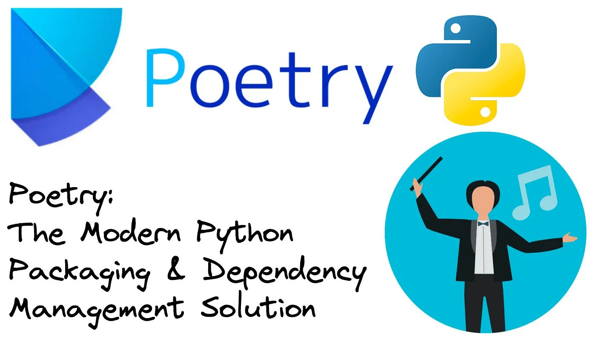

---
jupytext:
  text_representation:
    extension: .md
    format_name: myst
    format_version: 0.13
    jupytext_version: 1.14.6
kernelspec:
  display_name: jupyblog
  language: python
  name: python3
---

# Mastering Package Management with Poetry

In the realm of software development, especially within Python projects, managing dependencies can be a treacherous journey. Every developer has, at some point, faced the infamous "dependency hell" – that confusing tangle of mismatched package versions, obscure conflicts, and unresolvable errors. In this mini-project, we will be working with [Poetry](https://python-poetry.org/docs/), a Python dependency management and packaging tool that allows you to declare the libraries your project depends on and it will manage (install/update) them for you.



Image source: [Medium article: "Simplify Your Python Development with Poetry’s Packaging and Dependency Management"](https://levelup.gitconnected.com/simplify-your-python-development-with-poetrys-packaging-and-dependency-management-9d8b181f926f)

## Why Is Package Management Important?

Before delving into the nitty-gritty of Poetry, let's first understand the significance of package management:

**Reproducibility:** One of the cornerstones of software and data science is the ability to reproduce your work. Effective package management ensures that your code runs consistently across different environments.

**Collaboration:** When working in a team, it's imperative that everyone is on the same page concerning package versions. Without a robust package management system, you might find yourself in the notorious "but it works on my machine" scenario.

**Clean Environments:** Over time, your development environment can become cluttered with a mix of packages you've tried, tested, or tinkered with. Having a dedicated environment for each project ensures that dependencies for one project don't interfere with another.

**Version Control:** With the ever-evolving world of software, packages are frequently updated, sometimes introducing breaking changes. Proper package management allows you to specify and maintain package versions that are known to work together harmoniously.

## Why Poetry?
Poetry stands out from other package managers for several compelling reasons:

**Unified Tool:** While many tools like pip, pipenv, and setuptools often overlap in functionalities and confuse developers, Poetry offers a unified approach to package management and project configuration, eliminating the need for multiple tools.

**Locking Mechanism:** Poetry automatically generates a `poetry.lock`` file, ensuring that everyone working on the project gets the exact same dependencies.

**Intuitive Dependency Management:** Adding, updating, or removing dependencies is a breeze with Poetry's simple commands.

**Isolated Environments:** Poetry creates a virtual environment for your projects, ensuring dependencies for one project won’t disrupt another.

## Setting up a reproducible project for the movie recommendation system

This portion assumes you have [Miniconda](https://docs.conda.io/en/latest/miniconda.html) installed. If you don't, you can follow the instructions [here](https://docs.conda.io/en/latest/miniconda.html#latest-miniconda-installer-linksl) to install it.

Let's start by creating a virtual environment for our project. Open your terminal and run the following command:

```bash
conda create --name poetry-env python=3.10
```

Activate the environment:

```bash
conda activate poetry-env
```

Install Poetry:

```bash
pip install poetry
```

## Create a folder for your project with Poetry

Let's create a folder for our project and navigate into it:

```bash
mkdir mini-projects/
cd mini-projects/
poetry new movie-rec-system
```

This will create the following folder structure:

```bash
movie-rec-system
├── pyproject.toml
├── README.md
├── movie-rec-system
│   └── __init__.py
└── tests
    └── __init__.py
```

## How does Poetry track your dependencies?

Poetry uses `pyproject.toml` files to track your dependencies. This file is similar to `requirements.txt` files, but it's more powerful and flexible. It allows you to specify the exact versions of your dependencies, and it also allows you to specify the Python version your project supports. 

The file is split into three main sections `[tool.poetry]`, `[tool.poetry.dependencies]`, and `[build-system]`. The `[tool.poetry]` section contains metadata about your project, such as the name, version, and description. The `[tool.poetry.dependencies]` section contains a list of your project's dependencies. Finally, the `[build-system]` section contains information about the build system to use for your project.

Below is a sample `pyproject.toml` file.

```toml
[tool.poetry]
name = "movie-rec-system"
version = "0.1.0"
description = ""
authors = ["jpjon <jonathanphan@berkeley.edu>", "Laura <laura@ploomber.io>"]
readme = "README.md"

[tool.poetry.dependencies]
python = "^3.10"
duckdb = "0.8.1"
requests = "^2.31"
pandas = "^2.0.1"
matplotlib = "^3.6.0"
python-dotenv="1.0.0"
ploomber = "^0.22.4"
jupysql = "^0.9.0"
duckdb-engine = "0.9.2"

[build-system]
requires = ["poetry-core"]
build-backend = "poetry.core.masonry.api"
```

To install the dependencies, simply run

```bash
poetry install
```

### Adding a new dependency

Let's say we want to add a new dependency to our project. We can do this by adding it to the `pyproject.toml` under `[tool.poetry.dependencies]` file. 

For example, if we want to add `scikit-learn`, we would simply modify the `pyproject.toml` as 

```toml
[tool.poetry.dependencies]
python = "^3.10"
duckdb = "0.8.1"
requests = "^2.31"
pandas = "^2.0.1"
matplotlib = "^3.6.0"
python-dotenv="1.0.0"
ploomber = "^0.22.4"
jupysql = "^0.9.0"
duckdb-engine = "0.9.2"
scikit-learn = "^1.3.0"
```

then run 

```bash
poetry lock
poetry install
```

In the next section, we will learn how to set up a Ploomber pipeline to build a movie recommendation system.


