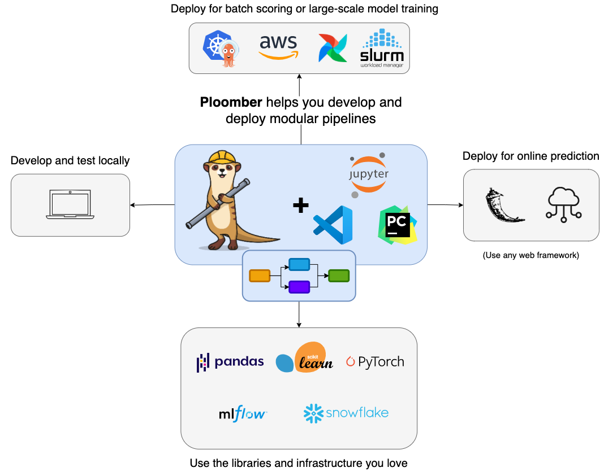

---
jupytext:
  text_representation:
    extension: .md
    format_name: myst
    format_version: 0.13
    jupytext_version: 1.14.6
kernelspec:
  display_name: Python 3 (ipykernel)
  language: python
  name: python3
---

# Expanding our ETL pipeline into an ETL-EDA pipeline

In the last section, we learned how to combine our ETL processes into a single Python script. We also learned how to run this script from the command line. In this section, we will learn how to expand our ETL pipeline into an ETL-EDA pipeline. We will learn how to incorporate exploratory data analysis (EDA) into our pipeline, and how to save the results of our EDA into a database. In this tutorial, we will introduce [Ploomber](https://docs.ploomber.io/en/latest/), a tool that will help us package `.py` scripts along with `.ipynb notebooks` into a single pipeline.

## Exploratory data analysis (EDA)

Suppose that we'd like to perform exploratory data analysis (EDA) on the data we downloaded. Suppose we have created a Jupyter notebook `eda-pipeline.ipynb` in the `src` directory.

Our goal is to identify tables and visualizations that will yield to interesting insights for a dashboard. We'd like to store these tables into our database for later use. We'd like to incorporate the results from this notebook into the pipeline. We will first show the kinds of queries we'd like to save, and how to create a new table for them. 

We'll start our `eda-pipeline.ipynb` Jupyter notebook as follows:

```python
# Loading in SQL extension
%reload_ext sql

# Initiating a DuckDB database named 'car_data.duckdb' to run SQL queries
%sql duckdb:///../data/database/car_data.duckdb
```

The following query will be used to understand the distribution and popularity of hybrid and electric vehicles for each model year, sorted by the number of vehicles. We will save this query as a table called `hybrid_electric`:

```python
%%sql
CREATE TABLE hybrid_electric AS
    SELECT DISTINCT model_year, vehicle_type, COUNT(id) AS num_vehicles
    FROM all_vehicles
    WHERE vehicle_type = 'hybrid' OR vehicle_type = 'electric'
    GROUP BY model_year, vehicle_type
    ORDER BY num_vehicles DESC;
```

Next, we'd like to address questions like:

1. What is the range in kilometers (km) for different electric vehicles?
2. How long does it take to recharge different electric vehicles?
3. What class does each electric vehicle belong to?
4. How do these characteristics vary by model year?

We can create a table `electric_vehicles` in our database that will help us address these questions as follows:

```python
%%sql 
CREATE TABLE electric_vehicles AS
    SELECT range1_km, recharge_time_h, vehicleclass_, model_year
    FROM electric;
```

We'd also like to be able to study differences in fuel consumption and CO2 emissions between different kinds of vehicles. We'll save the table as `fuel_co2`:

```python
%%sql
CREATE TABLE fuel_co2 AS
    SELECT vehicle_type, fuelconsumption_city_l_100km,  mapped_fuel_type, co2emissions_g_km	
    FROM all_vehicles
    WHERE fuelconsumption_city_l_100km is not null 
```

## Introducing Ploomber



[Ploomber](https://docs.ploomber.io/en/latest/get-started/index.html) is a Python package that allows you to build pipelines using Jupyter notebooks and Python scripts. It is designed to help you automate your data workflows, and to help you build production-grade data pipelines.

Ploomber is a great tool for data scientists who are familiar with Jupyter notebooks, and who want to automate their workflows. It is also a great tool for data engineers who are familiar with Python scripts, and who want to incorporate Jupyter notebooks into their pipelines.

## Installing Ploomber

We can install Ploomber with `pip`:

```bash
pip install ploomber
```

## Creating a Ploomber project

We can create a Ploomber project with the following command:

```bash
ploomber init
```

This will create a `pipeline.yaml` file, a `README.md` file, and a `src` directory. The `pipeline.yaml` file is where we will define our pipeline. The `README.md` file is where we will document our pipeline. The `src` directory is where we will store our Python scripts and Jupyter notebooks.

This folder structure meets the folder structure seen in the previous section. We can move our `datadownload.py` script into the `src` directory. We can also move our `eda-pipeline.ipynb` notebook into the `src` directory.

We will create an additional folder within pipeline called `products`. This is where we will store the outputs of our pipeline. 

Our folder structure will look as follows:

```bash
├── pipeline
│   ├── data
│   │   ├── database
│   │   │   ├── car_data.duckdb
│   ├── products
│   ├── src
│   │   ├── datadownload.py
│   │   ├── eda-pipeline.ipynb
├── Dockerfile
├── README.md
├── pipeline.yaml
└── requirements.txt
```

## Defining our pipeline

We can define our pipeline in the `pipeline.yaml` file. We will define our pipeline as follows:

```yaml
# Content of pipeline.yaml
tasks:
  - source: src/datadownload.py
    product:
      nb: products/datadownload.ipynb
      data: data/database/car_data.duckdb
  - source: src/eda-pipeline.ipynb
    product: 
      nb: products/eda-pipeline.ipynb
```

We can then run our pipeline with the following command from the command line:

```bash
ploomber build
```

## Expanding the Dockerfile to include Ploomber

We can expand our Dockerfile to include Ploomber. We will add the following lines to our Dockerfile:

```dockerfile
# Use the official Python image as the base image
FROM python:3.10

# Set the working directory
WORKDIR /app

# Copy requirements file and install dependencies
COPY requirements.txt .
RUN pip install --no-cache-dir -r requirements.txt

# Copy the rest of the application code
COPY . .

# Expose the port that the app runs on
EXPOSE 8000

# Install ploomber
RUN pip install ploomber

# Remove files ending in .metadata from the notebooks folder
RUN find notebooks -type f -name "*.metadata" -exec rm -f {} \;

CMD ["ploomber", "build"]
```

Remember to build the Docker image again with the following command:

```bash
docker build -t etlp:latest -f Dockerfile .
```

## Running the Docker image

We can run the Docker image with the following command:

```bash
docker run -it --rm -p 8000:8000 etlp
```

## Summary

In this section, we learned how to expand our ETL pipeline into an ETL-EDA pipeline. We learned how to incorporate exploratory data analysis (EDA) into our pipeline, and how to save the results of our EDA into a database. We also learned how to package our pipeline into a Docker container. In the next section, we will learn how to expand the functionality of our application through a Voila dashboard.