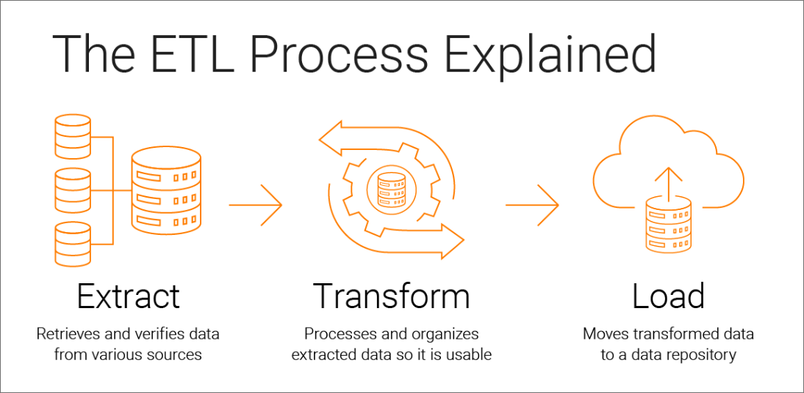
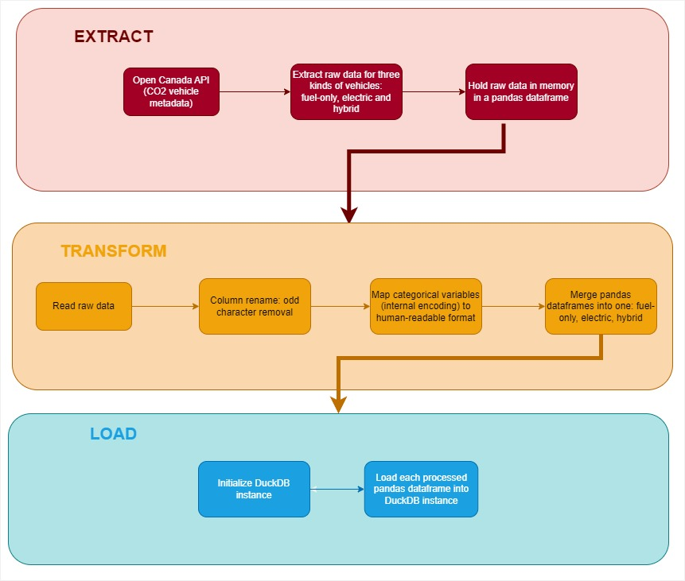

---
jupytext:
  text_representation:
    extension: .md
    format_name: myst
    format_version: 0.13
    jupytext_version: 1.14.6
kernelspec:
  display_name: Python 3 (ipykernel)
  language: python
  name: python3
---

# Building an ETL pipeline with Python and SQL

In this section of the course, you'll learn how to create your own ETL pipeline with Python and SQL. But before we get into the nitty gritty, we first have to answer the question: what are **ETL Pipelines**?

## ETL Pipelines



ETL (Extract, Transform, Load) pipelines are essential tools in the world of data engineering and analysis. They play a crucial role in collecting, cleaning, and preparing data for analysis or storage in databases. The three stages of ETL each serve a distinct purpose in the data pipeline:

1. Extract: In the extraction phase, data can be collected from multiple sources, such as databases, APIs, files, or web scraping. Python provides powerful libraries and modules, such as `pandas` and `requests`, that simplify data extraction tasks.

2. Transform: Once data is extracted, it often needs to be transformed to make it suitable for analysis or to meet specific requirements. Data transformation involves tasks like cleaning, filtering, aggregating, and/or joining, all things you should be familiar with by this point. This process can be done with either Python's `pandas` or SQL. 

3. Load: The final stage of the ETL pipeline is loading the transformed data, typically into a database. This step ensures that the data is stored in an easy to access format that allows for additional analysis. SQL is commonly used for interacting with databases, and Python provides libraries like `SQLAlchemy` for seamless integration. For this course, we'll focus on loading our data into a familiar database: DuckDB.

ETLs are essential for the data science work flow, as it aligns with the day-to-day tasks of modern day data scientist. This process provides data in a format that allows data scientists to readily use the data for predictive or inference modeling. Ultimately, this framework handles a significant portion of data preparation, allowing data scientists to concentrate on the modeling phase of their work. 

## Building the Pipeline

To implement an ETL pipeline with Canada's vehicle emissions data (introduced in the previous sections), we will use Python's `pandas` and `SQLAlchemy` like so:

1. Use Python's `requests` package to extract the data, documentation [found here](https://pypi.org/project/requests/)
2. Use `pandas` to appropriately transform the data for later use, documentation [found here](https://pandas.pydata.org/docs/)
3. Use `SQLAlchemy` to load the data into a DuckDB file, documentation [found here](https://docs.sqlalchemy.org/en/20/)

In fact, all of these steps are already included in a single script: `datadownload.py`. This script can be found from the course's GitHub repo that you can clone from here:

`git clone https://github.com/ploomber/sql.git`

Once you clone the repo, make sure that you have the correct dependencies by following the "Setup" instructions under the `CONTRIBUTING.md` files. Once you have the correct dependencies and environment, navigate to the `pipeline` folder and run the script with this line in your terminal: `python src/datadownload.py`. The script will extract, load, and transform the data and output a DuckDB file in the current folder with the name `car_data.duckdb`.

Before we dive into understanding how this script fundamentally follows an ETL pipeline, we have to briefly expand on some key points regarding DuckDB and `pandas`:

1. We use DuckDB because it allows us to store data in an in-memory database. Typically, the "loading" part of ETLs would require a server that hosts a database and usually requires additional configurations. DuckDB disregards the need for servers and allows users to locally load data. In our case, you can think of `car_data.duckdb` as our local database that we will be running queries against. DuckDB is an efficient and easy to set up database that is especially useful the in initial stages of the data science workflow. This database allows data scientists to check the usefulness of the data without having to cumbersomely set up a server to host the data. Reference the [previous module](https://ploomber-sql.readthedocs.io/en/latest/packaging-your-sql-project/intro-to-python-scripting-and-pipelines.html) to learn more about using Python with DuckDB. 

2. `pandas` is an extensive package. Comprehensively going through the entire library's documentation would be time-consuming and unnecessary for your understanding of the script. The script relies only on typical `pandas` functions, such as ones that help rename columns appropriately, clean data for null values, and create new columns. 

Let's now dissect `datadownload.py` and focus specifically on its functions that contribute to the ETL process.



### Extracting with Python

Let's break down our data extraction function `fuel_consumption_metadata_extraction` below. 

```python
def fuel_consumption_metadata_extraction() -> pd.DataFrame:
    """
    Extract metadata from fuel consumption data

    Returns
    -------
    final_result : pd.DataFrame
        Dataframe containing metadata from fuel consumption data
    """
    try:
        # Extract data in JSON format from URL
        url_open_canada = "https://open.canada.ca/data/api/action/package_show?id=98f1a129-f628-4ce4-b24d-6f16bf24dd64"  # noqa E501
        json_resp = requests.get(url_open_canada)
        # Check response is successful and application is of type JSON
        if (
            json_resp.status_code == 200
            and "application/json" in json_resp.headers.get("Content-Type", "")
        ):
            # Format data and obtain entries in english
            open_canada_data = json_resp.json()
            data_entries = pd.json_normalize(
                open_canada_data["result"], record_path="resources"
            )
            data_entries["language"] = data_entries["language"].apply(
                lambda col: col[0]
            )
            data_entries_english = data_entries[
                data_entries["language"] == "en"
            ]  # noqa E501
            final_result = data_entries_english[["name", "url"]]
        else:
            print(
                "Error - check the url is still valid \
                https://open.canada.ca/data/api/action/package_show?id=98f1a129-f628-4ce4-b24d-6f16bf24dd64"  # noqa E501
            )
            final_result = pd.DataFrame(columns=["name", "url"])
            sys.exit(1)
        return final_result
    except requests.exceptions.HTTPError as errh:
        print("Http Error:", errh)
    except requests.exceptions.ConnectionError as errc:
        print("Error Connecting:", errc)
    except requests.exceptions.Timeout as errt:
        print("Timeout Error:", errt)
    except requests.exceptions.RequestException as err:
        print("OOps: Something Else", err)
```

Notice how the function utilizes `try-except` clauses. Basically, these clauses will `try` a block of code. If this block of code returns an error, we can catch the error type with `except`. This ultimately helps us identify specific errors and makes troubleshooting much more manageable. 

Under the `try` block, the `requests` package is utilized to get the data from Canada's vehicle emissions data and converted into a `pandas` data frame. Then, the data frame is filtered to only include data sets in English alongside their respective urls. 

The `fuel_consumption_metadata_extraction` function ultimately returns a `pandas` data frame where each row is a data set. For each row, we'll be extracting the data with the `extract_raw_data` function below.

```python
def extract_raw_data(url: str):
    """
    Extract raw data from a URL

    Parameters
    ----------
    url : str
        URL to extract data from

    """
    try:
        # Perform query
        csv_req = requests.get(url)
        # Parse content
        url_content = csv_req

        return url_content
    except requests.exceptions.HTTPError as errh:
        print("Http Error:", errh)
    except requests.exceptions.ConnectionError as errc:
        print("Error Connecting:", errc)
    except requests.exceptions.Timeout as errt:
        print("Timeout Error:", errt)
    except requests.exceptions.RequestException as err:
        print("OOps: Something Else", err)
```

### Transforming with Python `pandas`

Our next step is to clean each of the extracted data sets with the `read_and_clean` function and concatenate them with the `concatenate_dataframes` function.

To summarize, our key transformations are:
- Column renaming to remove spaces and odd characters 
- String processing to make variables and values in a human readable format
- Producing a merged and concatenated dataset of all of our data thus far

There are some additional transformations outside of these functions under the main program of the script as well. The reason why they are outside of a function is because these transformations are unique to whether the data set is for electric, hybrid, or gas vehicles.

With this, we're ready to move forward and complete the last step of loading our data into a DuckDB file.

### Loading with `SQL`

Our last step simply loads our transformed data from their `pandas` data frame format into a DuckDB data base. We have created a couple of helper functions to achieve this:

```python
def create_table(con, table_name, df_var_name):
    """
    Create a table in DuckDB

    Parameters
    ----------
    con : duckdb.connect
        Connection to DuckDB
    table_name : str
        Name of the table to be created
    df_var_name : str
        Name of the dataframe to be used to create the table
    """
    con.execute(f"DROP TABLE IF EXISTS {table_name}")
    con.execute(
        f"CREATE TABLE {table_name} AS SELECT * FROM {df_var_name}"
    )  # noqa E501


def init_duck_db(duckdb_file_path):
    """
    Initialize DuckDB database and create tables for each dataframe

    Parameters
    ----------
    duckdb_file_path : str
        Path to the DuckDB database file

    """
    con = duckdb.connect(duckdb_file_path)

    # Drop tables if they exist
    create_table(con, "fuel", "fuel_based_df")
    create_table(con, "electric", "electric_df")
    create_table(con, "hybrid", "hybrid_df")
    create_table(con, "all_vehicles", "all_vehicles_df")

    con.close()
```

The first function `create_table` checks if a table exists, and if not it creates it. This function is called in the `init_duck_db` function to initialize the DuckDB instance and populate it.

We first create a directory to store our DuckDB file based on our current working directory. We then populate this newly created directory under `pipeline/data/database` with a file called `car_data.duckdb`. This can be seen under the main program of our script. We finalize this process with loading our data into `car_data.duckb` by using `duckdb`, a DuckDB `python` API. For more information on DuckDB's python API, please visit the official documentation [found here](https://duckdb.org/docs/api/python/overview).

```python
# Creating a new directory for DuckDB tables
database_directory = os.path.join(
    current_working_directory, "data", "database"
)  
Path(database_directory).mkdir(parents=True, exist_ok=True)

# Creating DuckDB file at new directory
duckdb_file_path = os.path.join(database_directory, "car_data.duckdb")
init_duck_db(duckdb_file_path)
```

Why are we naming the DuckDB file `car_data.duckdb`? We thought it would be appropriate given our data and because we think it follows the de facto standard of database naming conventions. [This article](https://dev.to/ovid/database-naming-standards-2061) is a great resource to learn more about this good to follow practice.

And that's it! You've just learned an overview of an ETL pipeline regarding the `co2_data` we'll be working with. 

## Conclusion

We've just demonstrated how the `datadownload.py` script creates an ETL pipeline with `pandas`, `requests` and DuckDB. You may be wondering why we're working with this specific tech stack. To be honest, it's because they're widely used, and for good reason. You've just seen first hand of how easy it is to create an ETL pipeline with just these tools. Remember, these are **just tools** that are one of many in a sea of others. We decided to use them because of how easy they are to use and to understand, especially in a course setting.

Moving forward, we can finally officially start running some EDA on our data in the `car_data.duckdb` DuckDB database and with `JupySQL`. Stay tuned!

## References

Informatica, What is ETL (extract transform load)? https://www.informatica.com/resources/articles/what-is-etl.html

Python `requests` 2.31.0, Updated May 22, 2023 https://pypi.org/project/requests/

Python `pandas` 2.0.3 https://pypi.org/project/requests/

SQL Alchemy 2.0 https://docs.sqlalchemy.org/en/20/

SQL Course Repository https://github.com/ploomber/sql

Database Naming Standard, Mar. 2 2021, Ovid https://dev.to/ovid/database-naming-standards-2061

DuckDB Python API https://dev.to/ovid/database-naming-standards-2061


